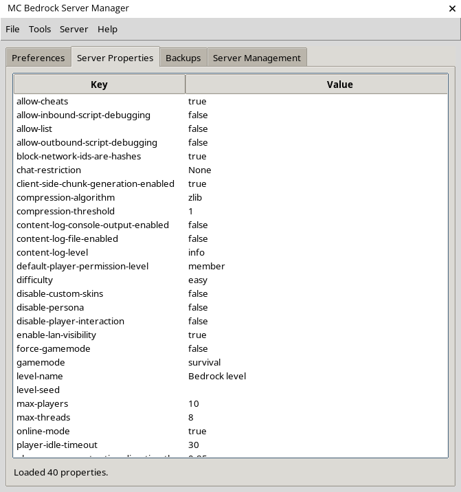
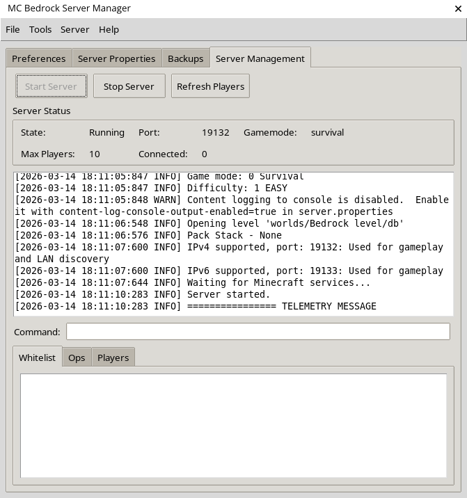
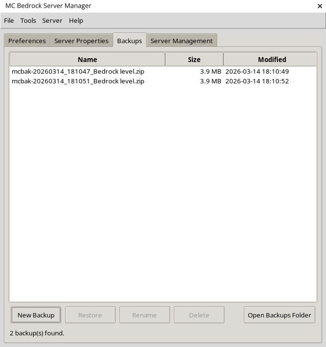

# Minecraft Bedrock Server Manager
MC Bedrock Server Manager is a simple and easy way to setup and manage your Minecraft Bedrock server, through the power of a GUI!

## Features
- A nice table view for editing `server.properties`
- Easy world backups management
- Start and manage server, view players list, all from a single view
- In the Web Manager console, when the server isn’t running you’ll see a simple “server is offline” message instead of an empty console area

## Screenshots

## How to use
For now, no binaries are provided. A `build_installer.py` is provided for you to create your own binaries if you wish.
But it's quite easy to run it yourself.

1. Install a Python 3.11+ runtime (Tkinter is required, which should be installed on your system by default. If it isn't, install it using pip or with your system's package manager if you're on Linux and pip method doesn't work).
2. Clone/download this repository and extract it to a folder.
3. Run the app with `python3 src/mc_bedrock_server_manager.py` from the repository root.
4. In the Preferences tab, choose the folder where you've downloaded the Bedrock server folder and choose or create a backups folder.
5. Edit `server.properties` if needed, and click start server and enjoy!

## Headless CLI (no Tkinter)
If you’re running on a headless server (no desktop environment), use the CLI entrypoint:

- Show help: `python3 src/mc_bedrock_server_manager_cli.py --help`
- Start only the Web UI: `python3 src/mc_bedrock_server_manager_cli.py --start-web --web-host 0.0.0.0 --web-port 5050`
- Start the server + Web UI: `python3 src/mc_bedrock_server_manager_cli.py --start-server --start-web --server-dir /path/to/server --backend endstone`

## Web manager (experimental)
The Web Manager is an **experimental** Flask + Bootstrap UI that runs alongside the desktop app.
Use it with caution: operations like backup creation/restores/deletes can modify files on disk.

1. Install the auxiliary web stack with `pip install flask`.
2. Open the new **Web Manager** tab, configure the host/port to taste, and click **Start Web Manager**.
3. Once running, the **Open Web UI** button opens the Bootstrap-powered interface. You can also browse to `http://<host>:<port>`.
4. The embedded Flask app polls `./api/status` and forwards `POST /api/command` requests so the web UI and desktop UI stay in sync.

## Endstone chat logger (optional)
If you run your server on Endstone, you can install the optional chat logger plugin in `endstone-chat-logger` to emit `[CHAT]` lines that the Web Manager chat panel ingests.

### Using Endstone as the server backend
Endstone wraps the Bedrock Dedicated Server (BDS) and enables plugins/events (including chat).

1. Install Endstone (same Python environment you use to run the manager): `pip install endstone`
2. In the desktop app **Preferences**, set **Server residing folder** to your extracted BDS folder (the folder containing the `bedrock_server` binary).
3. Set **Server backend** to `endstone` (desktop) or use the **Backend** dropdown next to the Start/Stop button (web).
4. Start the server from the manager. On Linux, the manager runs Endstone in non-interactive mode so it won’t block on prompts.

If Endstone ever says BDS is missing and asks to download it, your server folder selection/backend selection is wrong: the backend should be `endstone` and the server folder should be the BDS root (not a pre-made `bedrock_server/` directory).

## Notes
- Backup behaviour: Restoring a world renames the existing `worlds/<name>` directory to `Old_<world name>` (removing any previous `Old_<world name>`) before extracting the backup so the restored files reuse the original directory name.

## Bug reporting
If you find any bug, please report them in the Issues section of this repository! It will help me improve this software!

## License
Licensed under the [MIT License](LICENSE)
